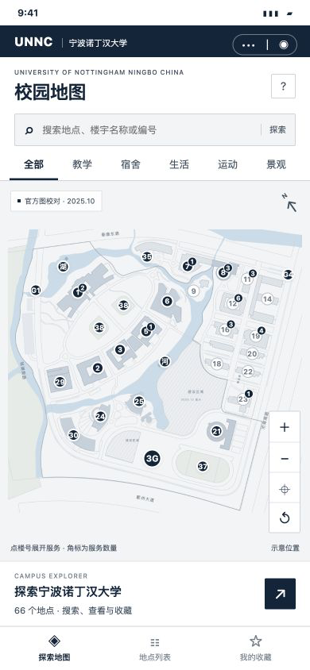

# UNNC Pocket Map · 宁诺口袋地图

[简体中文](README.md) | **English**

An independently developed **native WeChat Mini Program with a 2D campus map**, using place information from the University of Nottingham Ningbo China (UNNC) to explore campus buildings and nearby services.

**Current version: `0.1.0-beta.2`. An independent project, currently in beta.**

The October 5, 2026 beta includes map rendering optimizations, location reference notes and a full-width place list fix. Download the beta from [GitHub Releases](https://github.com/DanieeHan/unnc-pocket-map/releases). Testing on physical devices in WeChat is still pending.

> This open-source package includes an original placeholder grid, **not the actual campus map artwork**. You can try the code and interactions immediately. To recreate the campus map, import artwork you have permission to use and align it with the place coordinates. Real location support has not been calibrated and is disabled by default.



## Features

- 66 place records: 48 buildings, facilities and service locations, plus 18 additional services transcribed from commercial street photos.
- Category filters; search by Chinese or English name, abbreviation or building number; place descriptions, copying and WeChat sharing. Details and copied text retain building/area references and entrance-confirmation notes.
- Favorites stored on the current device, with no account, cloud database or backend service.
- Markers and labels avoid overlapping in screen space. Dormitories use short building numbers; buildings with a service count can expand a service list.
- Tap a place to center it; drag and pinch to zoom. Camera and zoom transitions take approximately 260 ms, and dragging interrupts animation.
- Tap an empty area of the map to dismiss the place preview or service list while keeping the current view.
- Code for one-time location requests, a location dot and accuracy circle, data collection and calibration is available, pending real measurements and field testing.

## Quick start

### WeChat Developer Tools

1. Import the repository root containing `project.config.json`. The Mini Program source directory is `miniprogram/`.
2. The default AppID is `touristappid`. Try the testing options supported by your tools; previewing on a phone, uploading and location permissions require your own valid AppID. Keep personal configuration out of the repository.
3. Compile `pages/map/index`. No npm dependencies or npm build step are required.
4. The first launch displays a placeholder grid. Follow the [map asset guide](docs/ASSETS.md) to replace it and the [location preparation guide](docs/LOCATION.md) to configure location support. These guides are currently in Chinese.

### Browser preview

With Python 3 installed, run this from the repository root:

```sh
python3 -m http.server 8765
```

Open <http://localhost:8765/preview/>. The preview supports mouse dragging, wheel zoom and touch interaction. It reads the actual WXML/WXSS and runs the same page logic, but it is not the WeChat runtime. Permissions, sharing, touch behavior and rendering still need verification in WeChat on physical devices. The browser preview does not collect real location data.

### Automated tests

Use Node.js 22 or later. No `npm install` is needed:

```sh
npm test
```

The seven test suites cover search and data, favorites, zoom limits, centering, gesture handling, menus, animation interruption, dismissal, coordinate fitting, failed and stale location callbacks, collection and saving, release package checks, WeChat JS module loading, calibration configuration consistency, label placement, and map rendering cache/payload regressions. Location tests use synthetic data and **do not replace field calibration**.

## Data and limitations

- Building names and numbers refer to the university map dated October 16, 2025. The library uses a short name on the main screen and retains its full official name in the description.
- The overview has 41 candidate map markers. The visible count depends on zoom, category and collision avoidance; hidden places remain searchable.
- The x/y values are percentages on the reference map, not GPS coordinates. Commercial street services use their building or area as an anchor, rather than an exact entrance.
- The app does not provide walking routes, indoor floor navigation, opening status, background location tracking or arrival estimates.
- Favorites stay on the current device and are not shared between the browser and WeChat.
- Real location support requires WeChat API permissions, privacy configuration, measured calibration points in a consistent coordinate system and physical-device validation. It is currently disabled.

## Project structure

```text
miniprogram/
  pages/map/             Map, list, details and favorites
  pages/calibrate/       Field collection tool (not registered in the public build)
  data/                  Places and uncalibrated location configuration
  utils/location.js      Coordinate conversion and bounds checks
  assets/                Original placeholder grid in SVG / PNG
preview/                 Interactive browser preview
scripts/                 Offline calibration and placeholder generation
tests/                   Automated checks
docs/                    Asset, location and release guides
```

## Contributing and license

Issues and improvements are welcome. Read the [contributing guide](CONTRIBUTING.md), currently in Chinese. For corrections to place information, include the source and date. Do not publish private configuration, raw location samples or images whose redistribution rights have not been confirmed in issues or pull requests.

The code, original documentation and placeholder grid are licensed under the [MIT License](LICENSE). See [THIRD_PARTY_NOTICES.md](THIRD_PARTY_NOTICES.md) for the sources and rights of map information and third-party names, the [release checklist](docs/RELEASE.md) for publication checks, and [CHANGELOG.md](CHANGELOG.md) for version history. These supporting documents are currently in Chinese.

This project is not affiliated with or endorsed by the University of Nottingham Ningbo China.

## Project demo

See the [demo guide](docs/DEMO.md) (Chinese) for a two-minute walkthrough, local preview commands and implementation notes.
